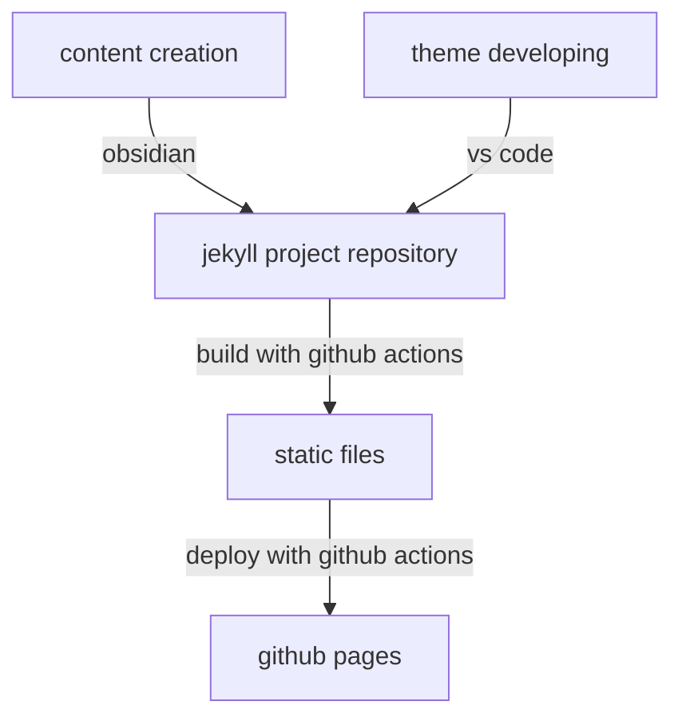

This is the repository for my personal blog [feeshy.github.io](https://feeshy.github.io)

- If you had any suggestions over content on this site, you're welcomed to start a [discussion](https://github.com/feeshy/feeshy.github.io/discussions). Please don't send pull requests.
- If you like my theme and would like to use it on your site, you're welcomed to fork [the theme's repo](https://github.com/feeshy/less-style-please). Please don't fork this repo.

## Workflow

I publish my blog posts using a cross-platform workflow that runs seamlessly on mobile devices. Building and deployment are automatically triggered via GitHub Actions in the cloud. The entire process can be handled within the Obsidian app, eliminating the need for Ruby or Jekyll on my local machine. This frees me to focus solely on content creation.

## Links

- [obsidian-git plugin](https://obsidian.md/plugins?id=obsidian-git) and how to [sync on your ios without any extra app](https://forum.obsidian.md/t/60639)
- [open with vscode](https://obsidian.md/plugins?id=open-vscode) obsidian plugin
- the Jekyll theme I used: [demo site](https://feeshy.github.io/less-style-please/) & [template repo](https://github.com/feeshy/less-style-please)
